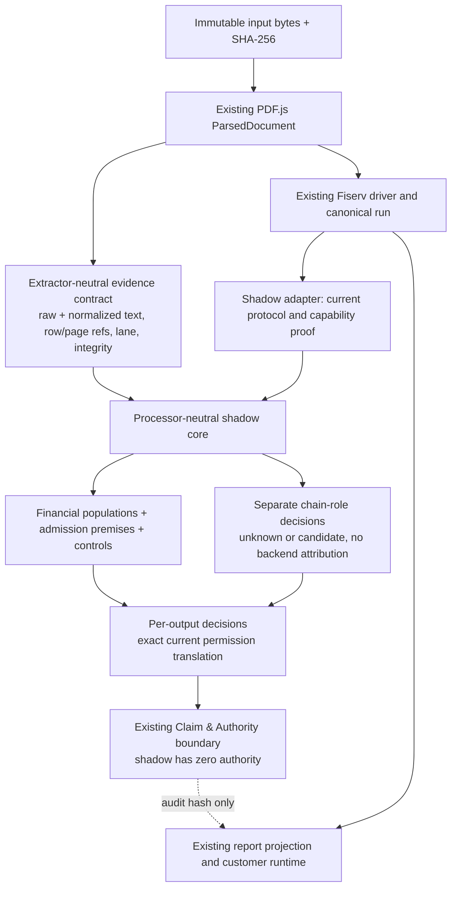

# Processor-neutral single-statement migration: Phase 0 and Phase 1

## Repository topology and scope

This worktree is `codex/processor-neutral-phase01`, created from `origin/main` at
`7b705023eaa593d298ffa6455be9224536d17822`. The active checkout at
`3f9328b` had substantial uncommitted work and remains untouched. The separate
Fiserv ingestion worktree remains at `e4877aa578668b0cc9458e7ac9b6fb317bf65bf9`;
it was inspected and replayed, not merged. Local `main` was stale at `30f63a9`.

Only one statement is analyzed at a time. The production parser, worker, canonical
builders, Claim & Authority rules, and report projection were not edited. No new
extractor, processor family, unresolved-lineage customer permission, or savings
semantics were introduced.

## Implemented boundary



`contracts.ts` defines document identity, page inventory, extractor lanes, source
coordinates, protocol candidates, chain roles, populations, assumptions, controls,
financial admission premises, per-output decisions, a run manifest, and the Claim
& Authority boundary. `shadow.ts` is the current Fiserv adapter. `core.ts` has no
Fiserv dependency and rejects any permission or financial admission that exceeds
the legacy translation. A legacy parser display brand is at most a candidate
without source proof; backend processor remains unresolved. The adapter records
all eight financial premises as `legacy_translated` for current permissions. It
does not assert that arithmetic or the current parser independently proves them.

The evidence adapter preserves raw rows and a separate normalized form. Its
normalization ports the useful typography and whitespace approach from `e4877aa`.
The direct-versus-recovered modality, artifact-integrity model, row reference,
and structural-signal design informed the generic contract. `e4877aa` Route A
origin terms were not copied into the core. The current PDF.js rows lack token
spans and polygons; these fields are explicitly null. A distinct extractor lane
may fill them later, after a benchmark and separate authorization.

## Phase 0 frozen authority matrix

`test/fixtures/phase01/authority-baseline.json.gz` records five checked-in PDF
fixtures. Each case captures the input hash, extraction and supplied-page
integrity, full legacy customer summary, the complete Report V1 projection with
a fixed generation timestamp (the current optional report route), parser
decision, canonical v1 financial
facts and customer permissions, F1 claim graph decisions and F4 Package E/savings
boundaries, canonical v2 financial facts with evidence and occurrence refs,
reconciliation status and refs, capability/admission proof, output permissions,
unresolved claim inventory, report experience/permissions/projection hash,
version manifests, and shadow decision trace. The full frozen matrix is gzip
compressed; `authority-index.json` exposes case totals, states, counts, and
full-surface hashes for code review. F2 is a hand-authored, test-only
evaluator in this repository, so it has no live per-document decision to freeze;
its existing regression suite is part of the parity gate. The cases cover a direct Fiserv route, a generic BASYS route,
a zero-volume statement, a parser refusal, and a public Fiserv guide sample.

`test/fixtures/phase01/remediation-contrast.json.gz` is a **separate** replay of
four shared fixtures at `e4877aa`. Its runner checks the exact commit and
records direct-versus-table-recovered signals, financial values, reconciliation,
claims, and output permissions. Its internal financial foundation hash differs
from the mainline hash. Three merchant fixtures have equal legacy headline
values, canonical financial facts, reconciliation, claims, and permissions.
The public guide sample intentionally differs: the base has no selected Fiserv
driver and its canonical run fails, while `e4877aa` recovers a table structure
and selects the generic driver. That driver still returns `reportable=false`,
but its legacy summary changes from `$956.90` volume / `$20.29` fees to `$37.00`
volume / `$0.00` fees. This is evidence against merging the remediation commit
as a behavior-preserving change. The two hashes are not treated as
interchangeable artifacts. `remediation-index.json` is the readable contrast
summary.

The matrix is deliberately a finite regression corpus, not a representative
statistical sample. It does not prove unknown-ISO financial admission, new
grammar accuracy, OCR, or cross-family support.

| Fixture | Legacy parser / reportable | Legacy volume / fees | Canonical facts / controls / unresolved claims | Canonical outputs |
| --- | --- | ---: | ---: | ---: |
| Public guide sample | none / n.a. | $956.90 / $20.29 | 0 / 0 / 0; run failed | 0 |
| November Clover | full / false | $53,291.02 / $1,330.96 | 19 / 55 / 539 | 17 |
| February Paysafe | processor / true | $36,912.94 / $1,565.73 | 19 / 35 / 91 | 17 |
| March BASYS | generic / true | $171,283.93 / $3,552.45 | 19 / 10 / 423 | 17 |
| September zero volume | processor / true | $0.00 / $44.90 | 19 / 17 / 23 | 17 |

The Phase 1 adapter changes zero production files. Replaying the five-case
matrix yields zero customer-summary, canonical v1/v2 financial, reconciliation,
F1/F4 Claim & Authority, report, and output-permission differences. The new shadow
decisions retain each legacy permission and grant no new one. The permanent
diff gate rejects widened canonical outputs, report permissions, and claims;
an attempted baseline refresh refuses any changed active or canonical surface.

### Legacy admission leak retained as a baseline defect

`Nov_2024_Statement.pdf` returns `parserDecision.reportable=false` and
`customerFacingTotalsAllowed=false`. `applyValidatedParserOutput()` still copies
the parser's `$53,291.02` volume and `$1,330.96` fees into the legacy summary.
The baseline records this customer behavior. The Phase 1 shadow does not alter
it. Correcting it requires a separately reviewed behavior change with a
before/after customer and Claim & Authority diff.

## Replay and authority gate

From this worktree, with the repository toolchain available:

```sh
node --import tsx scripts/phase01-authority-matrix.ts
node --import tsx scripts/phase01-remediation-contrast.ts
npm run build
node scripts/run-node-tool.mjs ./node_modules/vitest/vitest.mjs run test/processorNeutralPhase01.test.ts
```

The first command recomputes the matrix and fails on *any* changed baseline
surface; it also reports permission/claim widening explicitly. The second
replays the pinned remediation checkout. `--write` can refresh the shadow trace
only when frozen active and canonical surfaces stay identical. A behavior or
authority change requires a separately reviewed baseline version.
The old runtime path is the default and needs no flag. Omitting the shadow
observer is the rollback. The shadow test confirms that observing a run leaves
the existing canonical run byte-for-byte unchanged.

Verification on this worktree: production TypeScript build passed; all three
new boundary tests passed; the five-fixture authority replay and four-fixture
remediation replay passed. The focused regression batch had 119 passes and one
PDF parse timeout at the existing 60-second limit while tests ran together.
That parser suite passed all three tests when rerun alone with a 120-second
parse limit. The repository-wide test TypeScript configuration still emits
pre-existing diagnostics outside the changed files; the production build and
all executed runtime tests above passed.

## Deferred architecture debt

- Add token spans, page geometry, PDF.js parser configuration pinning, and
  artifact-level source provenance before additional extraction lanes.
- Prove assumption and independent-control premises directly rather than
  translating the current Fiserv policy. Do not use `legacy_translated` to grant
  a new capability.
- Build and review bounded, effective-dated chain knowledge releases and a
  resolver. No ISO graph or runtime research exists in this phase.
- Expand the contrast corpus with labeled unknown, conflicted, mixed-platform,
  duplicate, incomplete-page, and mutation cases before changing permissions.
- Correct the legacy `reportable=false` leak in a separately authorized change.
- Keep current Fiserv drivers as adapters until protocol packages and a new
  financial-admission implementation meet the authority parity gate.

**Phase 2 recommendation:** defer authorization. The foundation has a safe
shadow boundary and replayable five-case matrix, but direct premise proofs and
the broader labeled contrast corpus are still required before new behavior.
